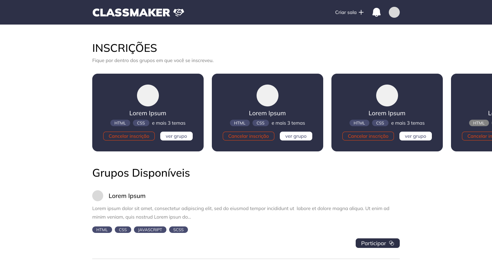

  
  <h1>ClassMaker </h1>
  

  <h2>O que é esse projeto?</h2>

  

    ClassMaker é uma aplicação com o propósito de conectar usuários com o interesse de 
    estudar os mesmo assuntos. Com ela, é possível definir assuntos de interesse para 
    encontrar outros usuários com o mesmo propósito e criar e participar de salas de estudo.
  

  <h2>Tecnologias utilizadas</h2>

  <ul>
    <li>Nextjs</li>
    <li>Typescript</li>
    <li>Cypress</li>
    <li>Firebase</li>
    <li>CommitLint</li>
    <li>Lucide</li>
    <li>TailwindCss</li>
  </ul>

